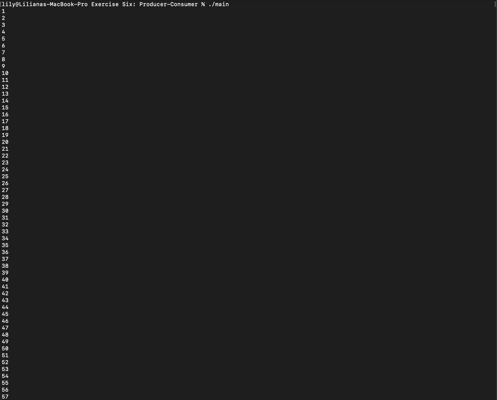

# Exercise Six: Producer-Consumer

Exercise Six in the concurrency module of Software Development in ITCarlow.\
An example of the producer consumer \

## Usage

```
make
./main
```

## Author
Liliana O'Sullivan
Joseph Kehoe

## License
[MIT](https://choosealicense.com/licenses/mit/)