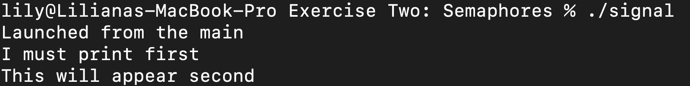

# Exercise Two/Semaphores

Exercise two in the concurrency module of Software Development in ITCarlow.\

## Usage

```
make
./signal
```

## Author
Liliana O'Sullivan

## License
[MIT](https://choosealicense.com/licenses/mit/)